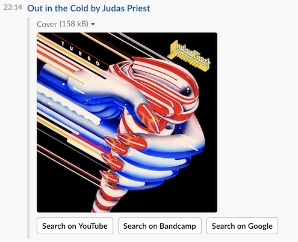

# last-slack

Script for sending the currently playing track on Last.fm to a Slack WebHook.\
Inspired by [last-slack](https://github.com/DekodeInteraktiv/last-slack) ❤️

cd

_Note: It will not send the track currently playing, only the last one played._

## Requirements

- [Node.js](http://nodejs.org/)
- An API key from Last.fm (found in [your API accounts](http://www.last.fm/api/accounts))
- An Incoming WebHook integration with your Slack account (see the [integrations](https://slack.com/services) page for more details)

## Installation

Install the requirements.

```shell
npm install
```

Copy the **.env-example** file to **.env** and change the Last.fm & Slack settings.

```shell
cp .env-example .env
```

## Usage

```shell
node index.js michaelenger
```

Use `--quiet` to prevent sending a message to Slack. The songs will still be shown in the terminal.

```shell
node index.js --quiet michaelenger
```

## License

MIT
